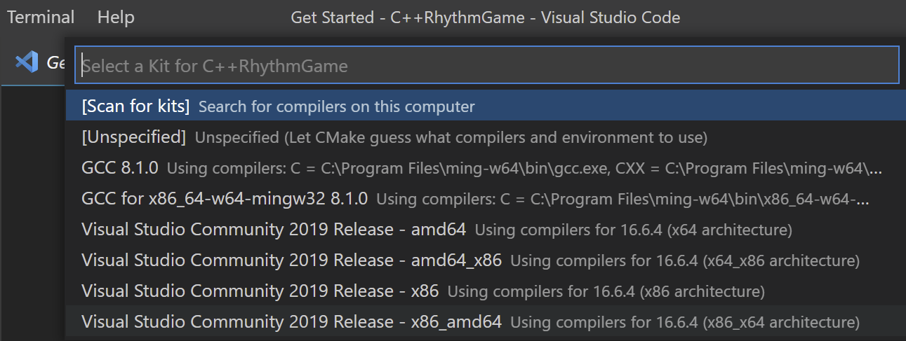

# VG101 Project README

## Project Group 30

## 1. Group Members:
|Name|Name in Hanzi|Student ID|
|----|-------------|----------|
|Binhao Qin|秦彬皓|519370910092|
|Jingbo Qu|瞿敬柏|519370910091|
|Wenqi Cao|曹文琦|519370910111|

## 2. Project Name: C++-based Rhythm Game

## 3. Programming Language: C++ 

## 4. Project Summary
This project aims to make a Vertical Scrolling Rhythm Game by C++ and OpenGL, with a User Interface provided.

## 5. Our Motivation
Music games can help players relax and increase their sense of music. Developing a simple music game is a challenge as well as a meaningful task for us. We can learn useful concepts and applications of C++ that may not be learned in class while developing. (e.g. class, virtual function, JSON file, OpenGL, etc.)

## 6. Game Settings and Configuration

### 6.1 Configuration File (`config.json`)
- A well-defined configuration file for our game must include following keys:
> e.g.
> ```json
> {
>   //Calibration Offset
>   //If you do the calibration before game, 
>   //it will dynamically change to the new value.
>   "calibration": 0,
>   //Visual Calibration Offset
>   "visualCalibration": 0,
>   //Difficulty Level
>   //This should be consistent with the diffculty level of your songTrackFile
>   "difficulty": "EASY",
>   //Music played when showing ending interface
>   //change to whatever you want
>   "endingMusicFileName": "Resources/Audio/ToTheEndsOfOurWorld.mp3",
>   //Fuzzy key judge, lowers difficulty
>   //If you accidentally hit the key next to the correct key, combo won't break.
>   "isFuzzyOn": false,
>   //Mapping keys to tracks
>   //9 ordered keys needed
>   //correspond to 9 tracks with their subscript in the string
>   "keyMap": "1234 7890",
>   //Path to your song music file, multiple formats accepted
>   //If it's not in the game's folder, use absolute path
>   "songFileName": "Resources/Audio/Utopiosphere.mp3",
>   //Song Name, consistent with your songFileName
>   "songName": "Utopiosphere",
>   //A DeeMo format JSON file, specifies Notes to hit
>   //consistent with the song you play and the difficulty you choose
>   "songTrackFileName": "Resources/Json/Utopiosphere.easy.json"
>}
> ```

- Configuration file for our game must be named and placed under `"Resources/Json/config.json"`, or you can launch our game with Command Line Argument: `--config "path of configuration file"`.

### 6.2 Song and Difficulty Selection
- Our game gives players freedom to a great extent, you can modify the `config.json` file to change configuration for what you want to play. As long as the player can prepare corresponding music and track file, this game just preforms as an interpreter.
- We have included 6 available songs for you. If you want to try more, please download by yourself.
- There are 4 Difficulty Levels (EASY, NORMAL, HARD and EXTREME). For beginners, EASY is recommended. To change difficulty level, the player need to change both the `"difficulty"` and `"songTrackFileName"` keys and provide a DeeMo format song track file of corresponding song and difficulty.
- Enjoy and feel free to create your own piece of music and corresponding DeeMo format song track file and share them to others!
- We have included 10+ available json files for you. If you want to try more, here is the GitHub repository for more DeeMo format song track files: https://github.com/MicroTransactionsMatterToo/DeeMo-song-files

### 6.3 Fuzzy Key Judge
- To enable this function, please set `"isFuzzyOn"` from `false` to `true` in your `config.json`.
- Fuzzy Key Judge means that you DO NOT need to strictly follow "One key, One column" in the Game Rule. Instead, if you press the adjacent keys to this key, it can also be accepted.
- For beginners, enabling this function is recommended.

### 6.4 Audio Calibration
- At the beginning of the game, player is recommended to press the space bar on the keyboard continuously for audio calibration.

   

- Under normal cases, calibration time is around 0.05 second. If it is larger than 0.1s, you are recommended to restart game and do the Audio Calibration again and press the space bar for more rounds.

   

### 6.5 Visual Calibration
- After audio calibration, player is recommended to press the space bar on the keyboard continuously according to the instructions for visual calibration.

   

- Under normal cases, calibration time is around 0.1 second. If it is larger than 0.15s, you are recommended to restart game and do the Visual Calibration again and press the space bar for more rounds.

### 6.6 Key Mapping
- To change the key mapping, change the value of `"keyMap"` in your `config.json`.
- Original Key Map is '1' '2' '3' '4' '(space)' '7' '8' '9' '0', corresponding to 9 tracks.

### 6.7 Default Configuration
- By default, the `config.json` under `Resources/Json/` will be used.
- Music Files should be under `Resources/Audion/`.
- JSON files should be under `Resources/Json/`.
> Here is the default `config.json` of our game
> ```json
> {
>   //value of last calibration
>   "calibration": 0.16160000000000008,
>   "difficulty": "EASY",
>   "endingMusicFileName": "Resources/Audio/ToTheEndsOfOurWorld.mp3",
>   "isFuzzyOn": false,
>   "keyMap": "1234 7890",
>   "songFileName": "Resources/Audio/Utopiosphere.mp3",
>   "songName": "Utopiosphere",
>   "songTrackFileName": "Resources/Json/Utopiosphere.easy.json",
>   "visualCalibration": 0.05451139999999999
>}
> ```

### 6.8 DeeMo Format Song JSON
- A well-defined DeeMo format song track JSON file has the following keys
> e.g.
> ```json
> {
>   //speed of the note to fall from the top of the screen to the judgement line
>   "speed": 10,
>   "notes":[
>       {
>           //id number
>           "$id": 1,
>           //not used in our game
>           "sounds": [
>               {
>                   "w": 0.33984375,
>                   "d": 0.08380675,
>                   "p": 64,
>                   "v": 78
>               }
>           ],
>           //song track, [-2,2] maps to [0,8]
>           "pos": -1.5, //at track subscript 1, number 2
>           //not used in our game
>           //constant for visible notes
>           "size": 1.30000007,
>           //the accurate time of this note to be hit by players
>           "_time": 2.046875
>       },//...
>   ],
>   //not used in out game
>   "links": [
>        {
>            "notes": [
>                {
>                    "$ref": "69"
>                },
>                {
>                    "$ref": "70"
>                }
>            ]
>        },//...
>    ]
> }
> ```
To Create Your Own Song Track:
- `"speed"` ranges from 5 to 20 in json files. For better game experience, 10 to 12 is recommended.
- You need to carefully adjust the `"notes"`, correct time and track brings better player experience.

## 7. Game Rule & Instructions

#### **==Use Headphones for Better Experience!==**
#### High-quality headphones or stereo are recommended for better acoustics.

### 7.1 Game Instructions
- Notes will show up in the Command Line Program.

- The Bottom Line is the Judgement Line which notes will fall towards from the top of the screen.

- These falling notes '#' must be tapped as close to the Judgement Line as possible. They follow the piano keys, sound effects, or instrumental keys.

   

- Each key (totally 9 keys, see Key Mapping) on your keyboard is responsible for the '#' in corresponding column (except for `"isFuzzyOn": true`).

- Players can tap (press) corresponding keys bound to several columns according to the music as notes hit the Bottom Line at the bottom of the screen.

- Game will start automatically after the Calibration.

### 7.2 Pause, Resume, Replay and Exit
- When gaming, press `ESC` key to pause the game.
- When the pause interface show up, it will prompt message that tells you `"Press ESC again to exit，or press Backspace to replay, or press another key to resume."`.
- As the prompt states, to exit the game, press `ESC` again in the pause interface; press other keys to resume.
- In the ending interface, the prompt message will tell you that `Press 'Backspace' to replay, press another key to exit.` You can press 'Backspace' to replay the game or press something else to close the window.

## 8. Judgement & Score Display
### 8.1 Judgement
Depending on how close a note is to the Bottom Line when it is tapped, following judgements can be obtained:

- Hits very near the Bottom Line are Charming Hits.
- Hits far from the Bottom Line or failures to hit are Misses.
- Judgement is independent of the speed of the song. Playing at a higher speed results in higher tolerance of note distance from the Bottom Line.

### 8.2 Rating
Performance is represented by a percentage rating in our game. This rating appears at the bottom of the screen during the game:

- Charming Hits contribute to the combo and the highest amount to the rating.
- Normal Hits contribute to the combo and a certain amount to the rating.
- Misses break the combo and DO NOT contribute anything to the rating.
- Hits are also worth more when the combo counter is higher. For this reason, a single combo of 100 hits is worth more than 2 separate combos of 50 hits each.
- Scores will be updated and calculated while playing.

### 8.3 Game Result
**After completing a song, the Result Screen will be displayed:** 

 

- The Charming Hits and Combo Counters display their associated values out of the total number of notes.
- The final Rating for the song is displayed.

## 9. Technical Issues

### 9.1 System Requirements
- This program only works on Windows x64 version currently.
- For detail requirements, please refer to the readme file of each library (included in the corresponding folder).
- For other systems, you can modify our code. Most external libraries we linked are cross-platform, you just need to change the `.dll` and `.lib` libraries to the corresponding version (See Project Reference Part). 

### 9.2 Project References
This part lists the external libraries and projects used in this project. 
- JSON for Modern C++. GitHub Repository: https://github.com/nlohmann/json
- irrKlang: Audio and Sound Libraries. Official Site: https://www.ambiera.com/irrklang/
- nupengl: OpenGL distribution for NuGet. NuGet Gallery: https://www.nuget.org/packages/nupengl.core/

### 9.3 Building Instructions
**To build this project from source code, you will need to install Visual Studio and Visual Studio Code on your computer.** 

> **Make sure that** your Visual Studio has **cmake.exe** in its common extensions, and your Visual Studio Code has **CMake** extensions as well.

 

**Then you can download our `.zip` file of the program from `github` and decompress it anywhere you want on your computer.** 

- Use Visual Studio Code to open the folder called "VG101_RhythmGame".

- Select Visual Studio 20XX `Release` and platform to `amd64`.

   

- Click the icon named "Build All Projects".

   

- Open directory `C++RhythmGame/build/Debug/`, double click `C++RhythmGame.exe`, and enjoy!

### 9.4 Exception and Error
Exceptions and Errors may occur when not well-defined file is parsed to the program or some files or library is missing. Basing on the information prompt, you can double check all these files and run it again. If it still fails to run, contact us at qinbinhao_umji@sjtu.edu.cn or davidcwq@sjtu.edu.cn. Remember to include pictures of your folder and files.